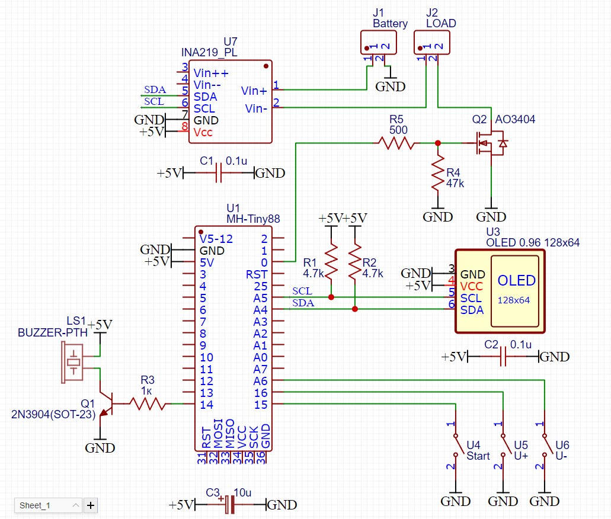

# Attiny Battery Tester

Простой тестер емкости аккумуляторов на Attiny88 и INA219  
Используется:  
[ATTinyCore](https://github.com/SpenceKonde/ATTinyCore)  
[NanoOLED](https://github.com/rede97/NanoOLED)  
[microWire](https://github.com/GyverLibs/microWire)  
[GyverINA](https://github.com/GyverLibs/GyverINA)  
TimerFF (многозадачность на millis())  
ButtonFF (обработка нажатия и удержание кнопки)  

"START/RESET" - Запуск и пауза замера, долгое удержание - сброс
"U+" и "U-" - настройка минимального напряжения разряд

## Схема

## Настройки

Обязательно "No bootloader", иначе прошивка не влезет (занято 93% флеша)  

